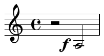
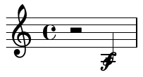

**_Scores of Beauty_ Engraving Challenges**
[`<= Introduction`](1-introduction.md)
[`Main page`](README.md)
[`Git introduction =>`](3-git-introduction.md)

-------------------------------------------

Editing workflow
----------------

You should follow the workflow described in this document as closely as
possible. We've set it up in order to provide a working situation that
offers the best possible basis for reliable comparison of different tools'
strengths and weaknesses.

However, if some of these guidelines come severely across the way your
tool suggests you to work, then you can of course deviate. But please
do so with enough documentation so we can see your reasoning (and learn
something about your tools).

Note that the goal is not to duplicate the layout of the original engraving.
We only ask that your score has the same line breaks as the original,
so that we would be able to make meaningful comparisons - feel free to
adjust other elements according to your preferences.

Documenting your progress
-------------------------

Please describe your progress and experiences in `progress-report.md`
[Markdown](http://en.wikipedia.org/wiki/Markdown) file.
If possible, please measure the time spent during each stage of your work,
so that we could judge how much effort went into creating your score.

#### Make snapshots of your score over time

**This is important!**
We want to know _exactly_ how the process of creating the scores looked like.
Therefore we ask you not only to describe it verbally, but also to save intermediate versions
of your score, so that we can _see_ how it changed over time.  As not everyone
has a copy of your notation software, please also save exported pdfs in addition
to your program-specific files.

In general, make a snapshot for a coherent set of changes, for example:
entering pitches and durations, adding articulations, or (later in the project)
even a single fix to an issue discovered during proof-reading.

For simple scores like Schumann's _Estrella_ we expect about
10 such savepoints; complex pieces like Godowsky's _Winterwind_ may
warrant something like 15-20 savepoints.  To make this easier for you,
in the next section we list specific stages when we expect you to make
a snapshot.

Creating and managing these savepoints is best done with a version control
system such as Git, but it can also be done manually.

#### With version control

Even if you are new to version control, we highly recommend using it -
start by reading the [Version Control Basics](2-version-control-intro.md).
Detailed instructions for setting up and using Git to manage an Engraving Challenge
are in [this document](4-using-git.md).

#### Without version control

If you _really_ don't want to learn using version control, you'll have to save
each version of your score in separate file(s).  We'll then add these files to the
repository for you (it may take us a couple days to do so, though - we're
quite busy).

Main stages of a challenge
--------------------------

Please prepare your score in the order described below.  Make at least one
snapshot (containing the engraving file(s) *and* a pdf) for each of these stages.
Look in the challenge description for more specific information.

#### Task Analysis and Initial Empty File

Have a close look at the assignment.  How do you expect your tools to be able
to deal with the task, what problems do you expect etc.?  Create an empty file
using your notation program, set paper size and margins to what the challenge
description says, and set up the score with the necessary information about
instruments and staves.  Make a snapshot.

#### Raw Music Entry

In the first step please enter the absolute "raw material". That is,
simply enter the musical content (notes, articulations, etc.)
but do *not* make adjustments to the layout.
The idea is to get an impression of what your tool produces without manual
intervention - we'd like to see how much work is required to tweak the score
to publication quality.

You can split this stage into two steps: in first, enter only pitches and durations
(this includes ties and augmentation dots), and in second add other elements
(articulations, dynamics, etc.).  However, this is not mandatory.

Most importantly, **do not** apply **any** individual adjustments -
it has to be the plain content that is entered.  Of course, you should
assign notes to correct voices (layers).

An example: imagine that you want to notate this:

But when you select the note and add dynamic to it, the new symbol lands on top
of the note:

**Do not** adjust the positioning of the dynamic at this stage -
we want to see _exactly_ what your notation software produces by itself.
You should fix such issues in "tweaking" stage.

We _strongly recommend_ that you check back with us before moving to the next stage,
to make sure that everything's ok.

<!--
#### Proof-reading / Peer review

Now the entered music should be proof-read. We can't prescribe too
specific workflows for this phase because they might differ between
the used tools. The only thing we require this to be done through
peer-review. That is, someone else has to proof-read the score. It is
up to you if you find a usable Git based solution or if you send a
printout by postal mail, just do it collaboratively and make notes
about your solutions.

Janek's comment:
I think we don't want to proof-read at this stage, because we actually
would *like* to see a few errors and the impact that fixing them makes
on a beautified score.  Maybe we should ask to introduce errors on purpose?

e.g. one pitch in wrong octave, one missing accidental,
one missing long slur...
-->

#### Adjust Line Breaking and Staff Size

Make sure that your score has the same line breaks as the original engraving.
Adjust staff according to your preferences (of course it would be good if it was
similar to the original engraving).

#### On/off Operations

Now you can perform "on/off" operations, like manually switching stem
directions, breaking beams, hiding unwanted rests etc. (adjusting
placement of elements is *not* an "on/off operation).

#### Global Layout Settings

Once the music is entered and we've seen the default output of your
program you can adjust the global settings - music font, thickness
of various elements, visibility of bar numbers etc.
Don't tweak individual objects yet.

#### Tweak to Usable Quality

One doesn't always need publication quality scores (e.g. for performance
material). So, start by fixing the most problematic issues (like collisions
between objects) and leave fine-tuning for the next step.

#### Tweak to Publication Quality

Now make your score as beautiful as you can. You're allowed to use *any*
tools your program offers, including third-party plugins, self-written
functions or established libraries - as long as you document it.

#### Proof-reading

Check your score for errors in the content as well as engraving shortcomings.
We're very interested in the impact that making fixes has on an already beautified score.
So, if adjusting a dynamic makes a slur move and collide with something else,
please make a snapshot in that state and then a separate snapshot for fixing
the colliding slur.

#### Version with Changed Layout

Imagine that your publisher decided to make another edition of the work, for example
an ebook for tablets, or a pocket version.  This needs a different page layout -
change paper size to 70% of the original, but keep staff size the same.
We'd like to see whether such a modified version will still look good, i.e.
how your previous adjustments will be treated by the software
(so, don't fix collisions and other problems caused by this change).

#### Transposed Version

This doesn't usually happen with publications, but when creatking performance
materials one sometimes needs to transpose the piece.  Please prepare two
additional versions - one a minor second higher, and one a major third lower.
(as above, don't fix layout problems caused by transposition).

Submitting your work
--------------------

If you're using Git, see [this section](4-using-git.md#submitting-your-changes).
Otherwise please send an email to the organizators.

Discussion
----------

Discuss and compare your results with others on our [forum](http://engravingchallenges.freeforums.org).
After your submission has been approved ("merged"), you should start a new thread
in the subforum of that particular challenge, titled "submission N: notation
software - your name".

After the discussion about a submission ends, we (or you) will create a summary
and add it to the submission files.

<!--
We decided to create a forum for discussions about Engraving Challenges.  This is slightly inconvenient as it requires participants to create an account in yet another web service, but we decided that using email is not a good option since our conversations wouldn't be easily available for the public.
-->

-------------------------------------------
**_Scores of Beauty_ Engraving Challenges**
[`<= Introduction`](1-introduction.md)
[`Main page`](README.md)
[`Git introduction =>`](3-git-introduction.md)
