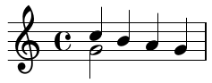
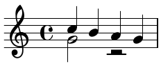

**_Scores of Beauty_ Engraving Challenges**
[`Main page`](README.md)
[`Introduction`](1-introduction.md)
[`Editing workflow`](2-editing-workflow.md)
[`Forum`](http://engravingchallenges.freeforums.org)

-------------------------------------------

Editing workflow
----------------

You should follow the workflow described in this document as closely as
possible. We've set it up in order to provide a working situation that
offers the best possible basis for reliable comparison of different tools'
strengths and weaknesses.

However, if some of these guidelines come severely across the way your
tool suggests you to work, then you can of course deviate. But please
do so with enough documentation so we can see your reasoning (and learn
something about your tools).

Note that you don't have to exactly duplicate the layout of the original
engraving.  We only ask that your score has the same line breaks as the original,
so that we would be able to make meaningful comparisons - feel free to
adjust other elements according to your preferences.

### Documenting your progress

Please document your progress and experiences in `progress-report.md`
[Markdown](http://en.wikipedia.org/wiki/Markdown) file.
If possible, please measure the time spent during each stage of your work,
so that we could judge how much effort went into creating your score.

#### Use Version Control

To make possible tracking your workflow, and performance od your program at different stages of work,
we decided to use a Version Control System - Git.  It will enable us to easily see how your score changed over time
by saving subsequent snapshots of your files (commits).

How to setup and use Git in Challenges is described in [setup](3-setup.md) and [collaboration](6-collaboration.md) sections.

If you are new to Version Control, read our [Version Control Intro](2-version-control-intro.md).
When you are done with setup, see also [Git crash course](4-learning-git.md).

### Commit frequently

**This is important!**
The main reason for using version control in Engraving Challenges
is to be able to see _exactly_ how the process of creating the scores
looked like in each notation program.  This will be possible only
if you make enough commits that show intermediate stages of your work,
so **please commit often**.

<!-- Use this somewhere?
Please commit very often. We're particularly interested in the detailed
documentation of the progress, therefore we need this information.
-->

In general, commit any coherent set of changes.  This may for example
be the addition of a complete voice, adding articulations, adjusting
dynamics, defining page layout or (later in the project) even a single
fix to an issue discovered during proof-reading.

For simple challenges like Schumann's _Estrella_ we expect about
10-15 commits; complex pieces like Godowsky's _Winterwind_ may
warrant something like 15-30 commits.

**Every so often, please create a new `.pdf`** file showing how your score looks
at the moment and add it to the commit.  This is _crucial_, as not everyone
has a copy of your notation software to open your program-specific files.
These pdf files should be numbered for easier navigation
(like this: `01-notes-only.pdf`, `02-with-articulations.pdf` etc.).
Not every commit should come with a new pdf, but we expect _at least_
7 pdfs documenting the progress of your challenge.

Note that you _shouldn't_ create copies of your program-specific file
(i.e. each new commit should contain a _modified_ version of the same file).

### Main Stages of a Challenge

Please prepare your score in the order described below.  Make a few commits
(including at least one with a pdf) for each of these stages.  Look in the
challenge description for more specific stages.

#### Task Analysis and Initial Empty File

Have a close look at the assignement.  How do you expect your tools to be able
to deal with the task, what problems do you expect etc.?

Create an empty file using your notation program, set paper size and margins to what
the challenge description says and commit it.

#### Raw Music Entry

In the first step please enter the absolute "raw material". That is,
simply set up your score with the necessary information about parts etc.
but do *not* make any adjustments to the layout.  The idea is to get
an impression of the out-of-the-box output of your tool.

Even more important: **do not** apply **any** individual adjustments -
it has to be the plain content that is entered.  Of course, you should
assign notes to correct voices (layers).

An example: imagine that you want to notate this:

But your notation software fills the lower voice with a rest, like this:

**Do not** remove the additional rest at this stage - we want to see _exactly_
what your notation software produces out-of-the-box.  You should remove such
unwanted elements in a separate commit in the next stage.

<!--
#### Proof-reading / Peer review

Now the entered music should be proof-read. We can't prescribe too
specific workflows for this phase because they might differ between
the used tools. The only thing we require this to be done through
peer-review. That is, someone else has to proof-read the score. It is
up to you if you find a usable Git based solution or if you send a
printout by postal mail, just do it collaboratively and make notes
about your solutions.

Janek's comment:
I think we don't want to proof-read at this stage, because we actually
would *like* to see a few errors and the impact that fixing them makes
on a beautified score.  Maybe we should ask to introduce errors on purpose?

e.g. one pitch in wrong octave, one missing accidental,
one missing long slur...
-->

#### Adjust Line Breaking and Staff Size

Adjust staff size and make sure that your score has
the same line breaks as the original engraving.

#### On/off Operations

Now you can perform "on/off" operations, like manually switching stem
directions, breaking beams, hiding unwanted rests etc. (adjusting
placement of elements is *not* an "on/off operation).

#### Global Layout Settings

Once the music is entered and we've seen the default output of your
program you can adjust the global settings - music font, thickness
of various elements, visibility of bar numbers etc.
Don't tweak individual objects yet.

#### Tweak to Usable Quality

One doesn't always need publication quality scores (e.g. for performance
material). So, start by fixing the most problematic issues (like collisions
between objects) and leave fine-tuning for the next step.

#### Tweak to Publication Quality

Now make your score as beautiful as you can. You're allowed to use *any*
tools your program offers, including third-party plugins, self-written
functions or established libraries - as long as you document it.

#### Proof-reading

Check your score for errors in the content as well as engraving shortcomings.
We're very interested in the impact that making fixes has on an already beautified score.
So, if adjusting a dynamic makes a slur move and collide with something else,
please make a commit in that state and then a separate commit for fixing
the colliding slur.

#### Version with Changed Layout

Imagine that your publisher decided to make another edition of the work, for example
an ebook for tablets, or a pocket version.  This needs a different page layout -
change paper size to 70% of the original, but keep staff size the same.
We'd like to see whether such a modified version will still look good, i.e.
how your previous adjustments will be treated by the software.

Submitting your work
--------------------

How to submit your work is described in [collaboration](6-collaboration.md) section.

Discussion
----------

Discuss and compare your results with others on [forum](http://engravingchallenges.freeforums.org).

We decided to create a forum for discussions about Engraving Challenges.  This is slightly inconvenient as it requires participants to create an account in yet another web service, but we decided that using email is not a good option since our conversations wouldn't be easily available for the public.

[forum](http://engravingchallenges.freeforums.org)

Rules:
- in the challenge boards, there should be only one thread for discussion about participant results.

After you consider your submission finished, and the pull request gets merged, yu should start a new topic onn the challenge board.

Afteer the discussion finishes, we will put the summary in ...

-------------------------------------------
**_Scores of Beauty_ Engraving Challenges**
[`Main page`](README.md)
[`Introduction`](1-introduction.md)
[`Editing workflow`](2-editing-workflow.md)
[`Forum`](http://engravingchallenges.freeforums.org)
